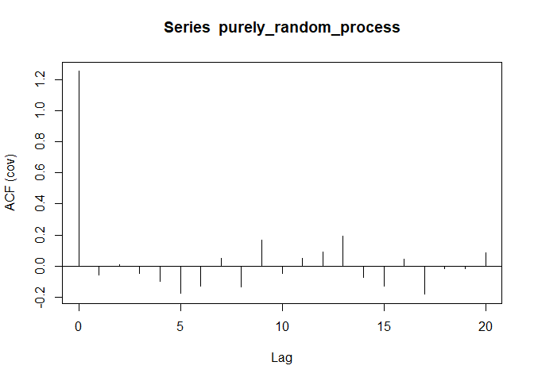
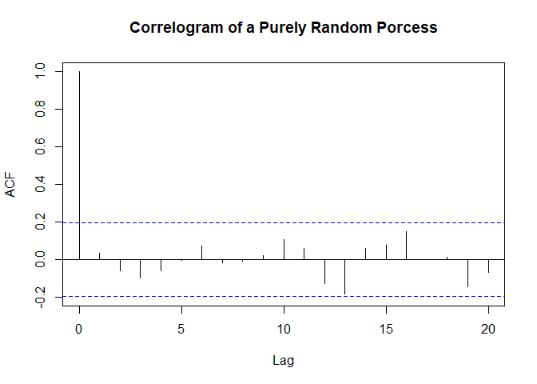

The Autocorrelation Function
================

## Creating a purely random time series with a normal distribution

  - with the use of the rnorm()
routine

<!-- end list -->

``` r
purely_random_process=ts(rnorm(100)) # 100 data points from std normal distribution that is a ts objecct
(acf(purely_random_process, type='covariance'))
```

<!-- -->

    ## 
    ## Autocovariances of series 'purely_random_process', by lag
    ## 
    ##        0        1        2        3        4        5        6        7 
    ##  1.25203 -0.05569  0.00971 -0.04905 -0.09615 -0.17681 -0.13055  0.04853 
    ##        8        9       10       11       12       13       14       15 
    ## -0.13545  0.16821 -0.04747  0.05116  0.08786  0.19378 -0.07379 -0.12909 
    ##       16       17       18       19       20 
    ##  0.04592 -0.18213 -0.01459 -0.01695  0.08482

  - We assume weak stattionarity
      - No systematic change in mean or variation
      - No periodic fluctuations

The acf() routine plots autocorrelation cofficients at differnt lags:
correlogram since it starts at 1 r0 = c0/c0 = 1

The resulting plot is the autocorrelation cofficients at different
lags.

``` r
( acf(purely_random_process, main='Correlogram of a Purely Random Porcess') )
```

<!-- -->

    ## 
    ## Autocorrelations of series 'purely_random_process', by lag
    ## 
    ##      0      1      2      3      4      5      6      7      8      9 
    ##  1.000 -0.044  0.008 -0.039 -0.077 -0.141 -0.104  0.039 -0.108  0.134 
    ##     10     11     12     13     14     15     16     17     18     19 
    ## -0.038  0.041  0.070  0.155 -0.059 -0.103  0.037 -0.145 -0.012 -0.014 
    ##     20 
    ##  0.068

R0 always starts at 1 and then we see that, then we see there isnt much
correlation between the other lags, and based on our selection of a
normal distribution and therefore we dont expect any correlation between
the lags.

The dashed lines show the significance leves and none of the lag spikes
crossing the dashed lines indiciate that there isnt any correlation
between our lags.
