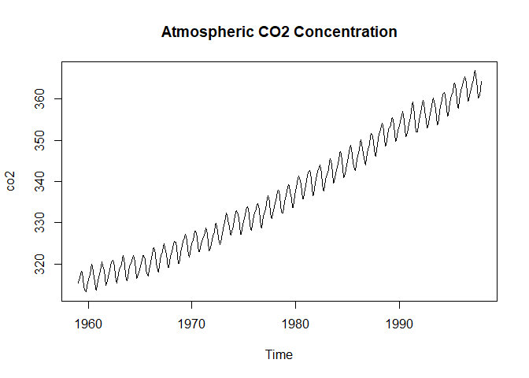
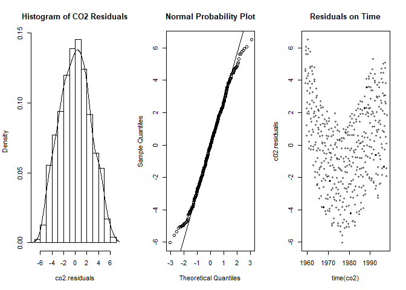
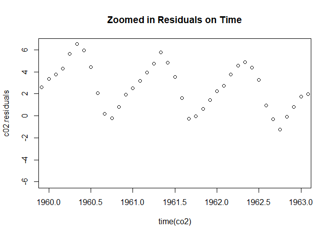
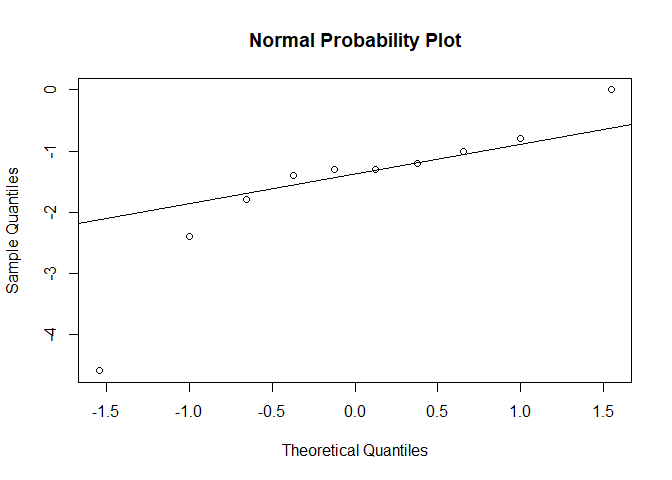

Intro to Time-Series Analysis
================

Exploring the CO2 data set to visualize time
series

``` r
class(co2) #Checking the "ts" class to represent time series
```

    ## [1] "ts"

``` r
plot(co2, main="Atmospheric CO2 Concentration")
```

<!-- -->

The obsevations of this general plot indiciate that there is an upward
trend which an oscilating nature which would be rather difficult to
interpret with a linear regression

``` r
co2.values = as.numeric(co2)
co2.times = as.numeric(time(co2))
```

Isolating the variable for each set into their respeictive parts: time
and value

Calculating the sum of squares for both random
variables

``` r
SSxy = sum((co2.values - mean(co2.values) ) * (co2.times- mean(co2.times)))
SSxx = sum((co2.times - mean(co2.times) ) * (co2.times- mean(co2.times)))
( slope = SSxy / SSxx )
```

    ## [1] 1.307497

``` r
( intercept = mean(co2.values) - slope*mean(co2.times))
```

    ## [1] -2249.774

Based on this the slope of the linear regression is 1.307 and the
intercept is -2249.774

The line is plotted below on the same curve. A few observations:

  - 1960 - 1970 the data collected is above the regression line
  - 1970 - \~1985 the data collected is below the regression line
  - 1985+ the data lies above the regression line

<!-- end list -->

``` r
co2.linear.model = lm(co2 ~ time(co2) ) #Making the Linear Model
plot(co2, main='Atmospheric CO2 Concentration with Fitted Line')
abline(co2.linear.model )
```

<!-- -->

To explore this relationship more lets look at the residual values

``` r
co2.fitted.values = slope*co2.times + intercept
co2.residuals = co2.values - co2.fitted.values
```

Lets plot the relationship of the residual values:

``` r
par(mfrow=c(1,3))
c02.residuals = resid( co2.linear.model )
hist(co2.residuals, main= "Histogram of CO2 Residuals", freq=F)
lines(density(co2.residuals))
qqnorm(c02.residuals, main= "Normal Probability Plot")
qqline(c02.residuals)
plot(c02.residuals ~ time(co2), main="Residuals on Time")
```

<!-- -->

So exploring the three plots here a little bit, it can be concluded that
the frequency histogram depects a distrubion that is not entriely normal
as there is some “inward bending” iin the 2-4 intervals, but to examine
it further we should look at the probability plot.

Looking at the probability plot we see deviation from the systemic line
plotted in the middle graph and that indicaties departure from
normality.

This third graph follows with our observations on how the data fit
within the regression line. The values above the regression line are the
same values here between the years 1960 - 1970.

``` r
par(mfrow=c(1,1)) #Return the plot size back to original
plot(c02.residuals ~ time(co2), xlim=c(1960, 1963), main="Zoomed in Residuals on Time")
```

<!-- -->

Here the oscilating nature of the data is oberved again.

  - Further Statistics Review \*

To review more statistical concepts we are going to explore a differnt
data set. This data set demonstartes the difference between extra hours
of sleep on the same 10 people between two drugs which are both
indicated by group 1, and group
2.

``` r
plot(extra~group, data=sleep, main ="Extra Sleep in Gossett Data by Group")
```

<!-- -->

``` r
attach(sleep) #allows us to refer to the data frame without calling it again
extra.1= extra[group==1] #seperating into drug 1 
extra.2= extra[group==2] #seperating into drug 2
```

The plot shows leads us to belive that drug two clearly has a higher
number of people who obersved extra hours of sleep.

To conclude a statsitical inference we can use a t-test.

``` r
t.test(extra.1, extra.2, paired=TRUE, alternative="two.sided")
```

    ## 
    ##  Paired t-test
    ## 
    ## data:  extra.1 and extra.2
    ## t = -4.0621, df = 9, p-value = 0.002833
    ## alternative hypothesis: true difference in means is not equal to 0
    ## 95 percent confidence interval:
    ##  -2.4598858 -0.7001142
    ## sample estimates:
    ## mean of the differences 
    ##                   -1.58

Now here we see a high t value and a very low p value. The p value here
is much lower than the a value of 0.01 which leads us to reject the null
hypothesis and accept the alternate hypothesis that the drugs do indeed
have an impact on extra hours of sleep.

For the tests to be valid we have to assume the differences are normally
distributed:

``` r
diffs = extra.1-extra.2
qqnorm(diffs, main= "Normal Probability Plot")
qqline(diffs)
```

<!-- -->

While the outliers are slightly concerning we can establish that the
differences are normally distrubed generally.
