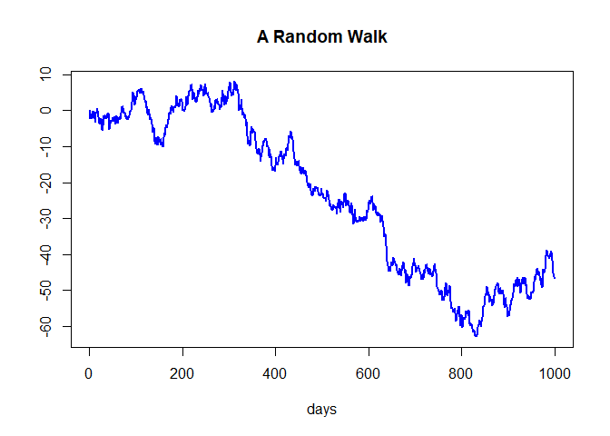
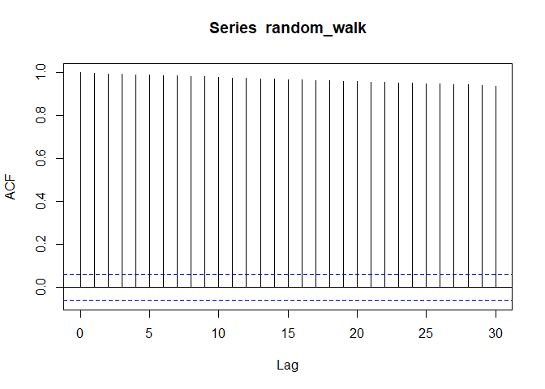
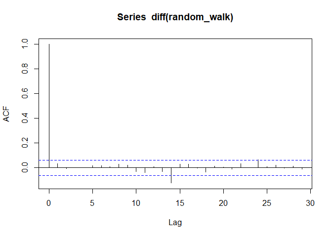

Random Walks and Moving Average Processes
================

## Model to get Started

\[X_t = X_{t-1} + Z_t \] where \[X_t\] represents location at time t or
the price of stock today, and \[ X_{t-1}\] is the location of the
previous step or the price of the stock yesterday, and \[ Z_t \]
represents white residual noise and further more more comes from
\[ Z_t \sim Normal(\mu,\sigma^2) \]

Assume we start at point 0, and based on the equation shown above at
time x1 we are at x0 + z1 therefore x1 is z1, and then eventually x2 is
z1 + z2, x3 = x2 + z3 –\> z1 + z2 + z3

Further exploring the expected value and variance of this function we
arrive to the conclusion the that the expected value is \[ \mu\t \] and
the variance is \[ \sigma^2\t \], this leads to the conclusion that we
are dealing with systematic changes in both the mean and the variance
and therefore our time series is not stationary

Lets see this in process

``` r
x = NULL
x[1] = 0
for(i in 2:1000){
  x[i] = x[i-1]+rnorm(1)
}
# At this point this is not a time series object
random_walk=ts(x) # this makes it a ts object
plot(random_walk, main="A Random Walk", ylab=' ', xlab = 'days', col='blue', lwd=2)
```

<!-- -->

Now this looks a lot like a stock price chart, lets see if we can plot
the ACF(). Since this series is not stationary, it wouldnt make sense to
use ACF since we used ACF only on stationary
series

``` r
acf(random_walk)
```

<!-- -->

As we can see from the ACF there is an very high correlation even 30
lags back symbolizing that these processes are indeed correlated.

## Finding the difference

``` r
#Finding the difference between the lags
plot(diff(random_walk))
```

<!-- -->

When solving the equation above for the change between the two x terms
we can isolate for the z or random noise term. The plot confirms that
hypothesis as this looks like an entirely random process.

We can futher extrapolate our understanding by taking an acf of this
function

``` r
acf(diff(random_walk))
```

<!-- -->

This is the same acf that was generated last lecure on a random
distribution where the auto correlation is very low between various
lags.

## Introduction to Moving Average Processes:

``` r
#Generate noise
noise = rnorm(10000)

#Introduce a variable
ma_2=NULL

#Loop for generating MA(2) Porcesses
for(i in 3:10000){
  ma_2[i]=noise[i]+0.7*noise[i-1]+0.2*noise[i-2]
}

#Since we had to start at index 3 we can shift our data points 2 units over to remove those values
moving_average_process=ma_2[3:10000]

#make this a time series obkect
moving_average_process=ts(moving_average_process)

#partition output graphics as a multi frame of 2 rows and 1 column
par(mfrow=c(2,1))

# plot the process and plot is ACF
plot(moving_average_process, main="A Moving Average Process of Order 2", ylab=" ", col="blue")
acf(moving_average_process, main='Corellogram of a moving average process of order 2')
```

<!-- -->

Looking at the ACF of MA(q) processes we see the expected 1 correlation
at 0 lag, but there is still a high correlation at lag 1 and lag 2 which
show us the order of the MA(q) process by cutting off at lag q
