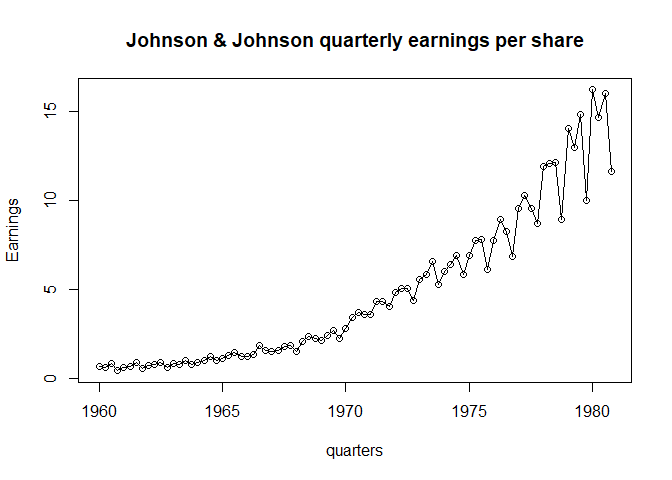
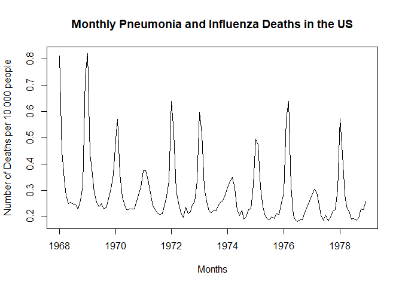
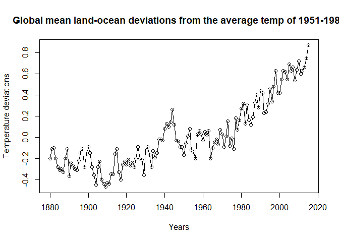
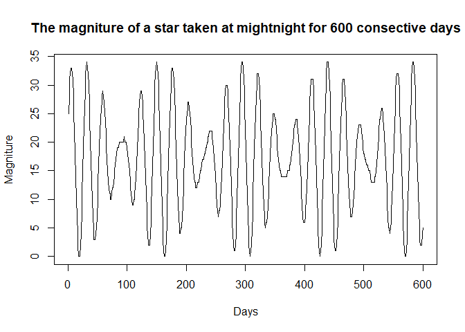

Visualizing and Describing a Time Series, time plots, autocovariance,
and auto correction
================

## Johnson Johnson Quarterly Earnings Analysis of (jj) data set

  - US company Johnson and Johnson
  - Data set contains 84 quarterly earnings
  - Q1 1960 - Q4
1980

<!-- end list -->

``` r
require(astsa)
```

    ## Loading required package: astsa

``` r
plot(jj, type='o', main='Johnson & Johnson quarterly earnings per share', ylab='Earnings', xlab= 'quarters')
```

<!-- -->

  - There is also a general upwards trend as the quarters increase so
    does EPS
  - At the beginning there isn’t much variation but as the quarters
    increase there is alot more fluctuation
  - This violates the Stationary principle
  - There is also apparent seasonal changes on the trend

## Pneumonia and Influenza Deaths in the US Analysis of (flu) data set

  - Monthly pneumonia and influenza deaths per 10 000 people
  - 11 years
  - from 1968 to
1978

<!-- end list -->

``` r
plot(flu, main="Monthly Pneumonia and Influenza Deaths in the US", ylab= 'Number of Deaths per 10 000 people', xlab='Months')
```

<!-- -->

  - Very apparant seasonality, peak after every year in the dataset
    maybe in the summer
  - not a stationary time series
  - Overall trend is decreasing over the yeras

## Land-Ocean temperature deviations; Analysis of the (globtemp) dataset

  - Global mean land-ocean temp deviations
  - deviations from the base period 1951 - 1980
  - Measured in degrees celcius
  - For the years 1880 - 2015
  - From
NASA

<!-- end list -->

``` r
plot(globtemp, main='Global mean land-ocean deviations from the average temp of 1951-1980', ylab='Temperature deviations', type='o', xlab='Years')
```

<!-- -->

  - From this timeplot there is is an apparnt increase in deviations
  - There is also seasonality in the trend –\> maybe due to seaons?

## Variable Star; analysis of the (star) dataset

  - The magnitude of a star taken at midnight
  - For 600 consecutive days
  - The data are from the “The Calculus of
Observations…”

<!-- end list -->

``` r
plot(star, main="The magniture of a star taken at mightnight for 600 consective days", ylab = 'Magniture', xlab='Days')
```

<!-- -->

  - There is apparant seasonality and perodicity in this data set.
